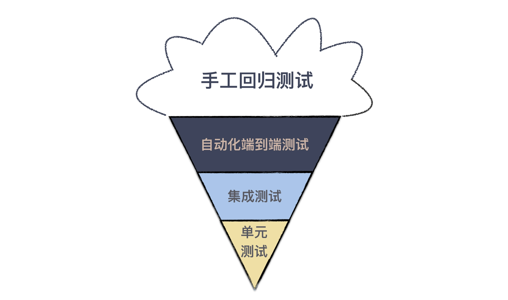
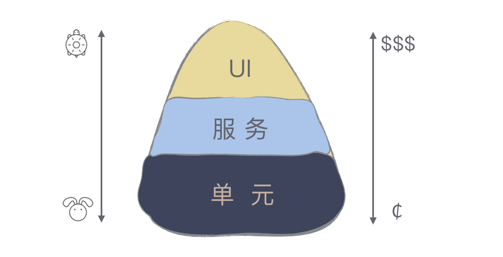

# 10x程序员工作法-0312学习笔记
## 测试也是程序员的事吗？
测试是程序员工作的一部分。现在有很多公司会要求行覆盖率到达什么样的程度，项目验收标准里同样也有对行覆盖率的要求。行覆盖绿、分支覆盖率等都是程序员的工作，而不是测试人员的工作，写这部分我们一般叫做写单测。
软件变更成本，它会随着时间和开发阶段逐步增加，所以我们尽可能早的发现问题，修正问题，这样才是消耗最低的。
理想的情况是吗，质量保证是贯穿在软件开发全过程中，从需求开始的每一个环节，都将“测试”纳入考量。
需求人员要确定验收标准，开发人员则要交出自己的开发者测试。
所以，对于程序员来说，只有在开发阶段把代码和测试都写好，才有资格说，自己交付的是高质量的代码。

### 测试模型：蛋卷与金字塔
测试按照不同层次进行划分：将测试分成关注最小程序模块的单元测试、将多个模块组合在一起的集成测试、将整个系统组合在一起的系统测试。
直觉上越高层的测试覆盖面越广，于是多写高层的测试，底层的测试做补充，就形成了蛋卷测试模型。但是这种模型使用起来费时费力，因为准备高层测试实在太麻烦了。

行业里的最佳实践是：测试金字塔。

越是底层的测试，牵扯到相关内容越少，而高层测试则涉及面更广。
而且小事反馈周期短，大事反馈周期长。反映到测试金字塔上就是，在单元测试阶段发现问题，资源消耗是最小的。越上层的测试出现问题，资源消耗越多。单元测试相对高层测试来说也是最容易写的。所以测试金字塔才会成为行业的最佳实践。

今天需要记住的一件事是：*多写单元测试*。

此文章是学习笔记，内容来源于：极客时间《10x程序员工作法》，强烈推荐此课程。