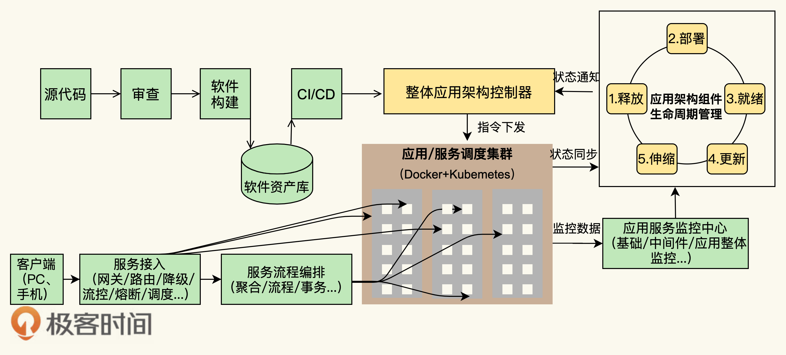

# 0315左耳听风学习笔记

## 分布式系统关键技术：洞悉Paas平台的本质
一家商业公司的软件工程能力主要体现在三个地方
第一，提高服务的SLA
第二，能力和资源重用或复用
第三，过程的自动化

分布式的技术点是高度一致的，也就是下面三个方面的能力。
- 分布式多层的系统架构
- 服务化的能力供应
- 自动化的运维能力

### PaaS平台的本质
一个好的PaaS平台应该具有分布式、服务化、自动化部署、高可用、敏捷以及分层开发的特征，并可与IaaS实现良好的联动。
PaaS和传统中间件最大的差别。
- 服务化是PaaS的本质。软件模块重用，服务治理，对外提供能力是PaaS的本质。
- 分布式是PaaS的根本特性。多租户隔离、高可用、服务编排是PaaS的基本性质。
- 自动化是PaaS的灵魂。自动化部署安装运维，自动化伸缩调度室PaaS的关键。

### PaaS平台的总体架构

在Docker+Kubernetes层之上，我们看到了两个相关的PaaS层。一个是PaaS调度层，很多人将其称为IPaaS；另一个是PaaS能力层，通常被称为aPaaS调度层，PaaS能力层很难被管理和运维，而没有PaaS能力层，PaaS就失去了提供实际能力的业务价值。

在两个相关的PaaS层之上，有一个流量调度的接入模块，这也是PaaS中非常关键的东西。
- PaaS调度层-主要是PaaS的自动化和分布式对于高可用高性能的管理
- PaaS能力服务层-主要是PaaS真正提供给用户的服务和能力
- PaaS的流量调度-主要是与流量调度相关的东西，包括对高并发的管理
- PaaS的运营管理-软件资源库、软件接入、认证和开放平台门户
- PaaS的运维管理-主要是DevOps相关的东西

PaaS平台的生产和运维流程

此文章为3月Day7学习笔记，内容来源于：极客时间《左耳听风》，强烈推荐此课程。

